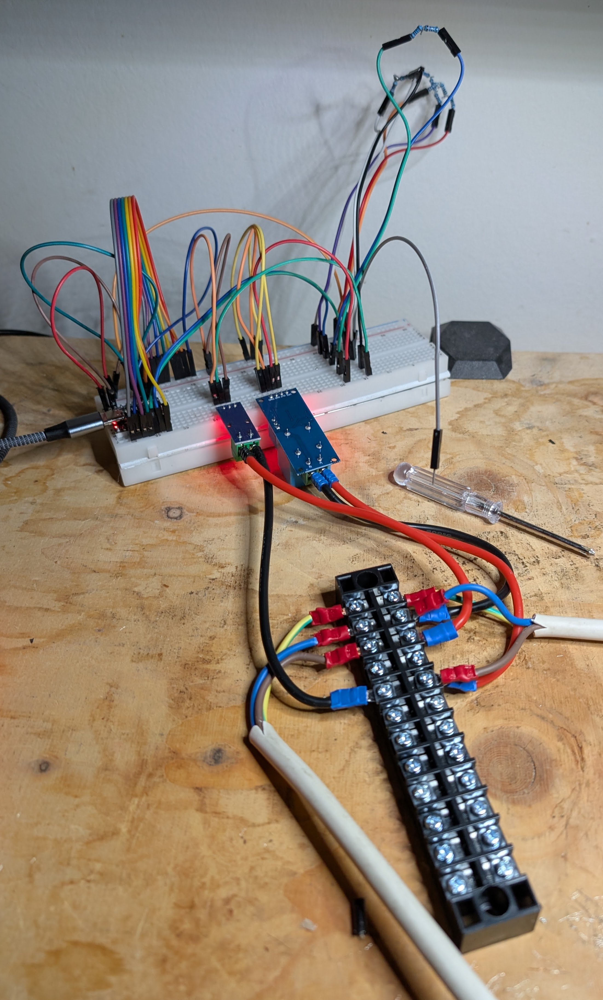
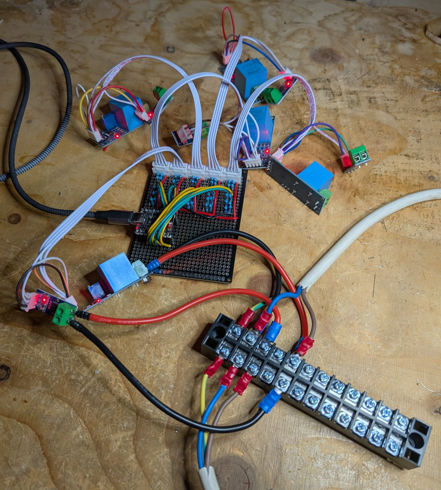
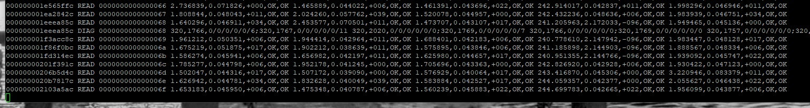
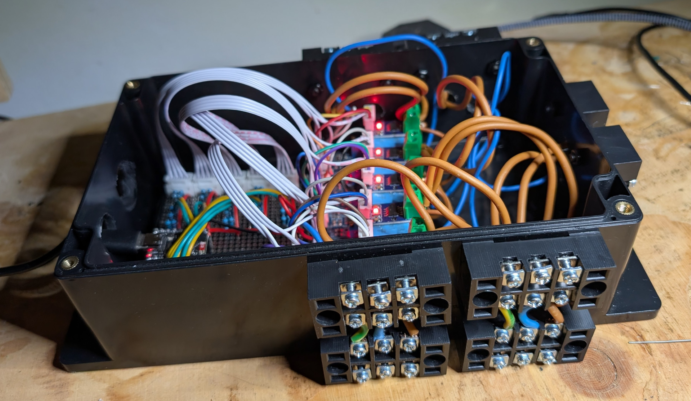

Simple mains-level AC power monitor implemented on ESP32 (ESP-IDF) using ACS712 (current) and ZMPT101B (voltage) sensors providing voltage, current and phase over USB.

**DETAILS**

Supports 5 devices (using 10 sensors) to read up to 500VAC at 50A on each.
Using an ESP32-S3 which has sufficient GPIO pins and 10 ADC channels for ADC continuous read functionality to simplify implementation.
Sensors are 5V level and outputs are voltage divided (20K/30K) to 3V for ESP32 GPIO ADCs.
Prototyped using generic ESP32-S3 supermini board with generic ACS712 and ZMPT101B breakout boards.
ESP32-S3 is powered from USB and sensors are 5V powered from ESP32-S3 5V pin: no additional power circuitry.
No other components needed other than micro, sensors and voltage divider resistors (and wiring terminals).

Outputs single lines of text with the format ``timestamp type counter content``, where ``timestamp`` is nanoseconds since startup (16 characters, base-16), ``type`` is a string (``INIT``, ``TERM``, ``READ``, ``DIAG``, ``FAIL``), ``counter`` is the ``READ`` counter (16 characters, base-16) (even if not the ``READ`` line), and ``content`` depends on the type.
* ``INIT`` provides hardware and software details and parameters and is issued once when the powermon starts/restarts.
* ``TERM`` is issued when the powermon stops gracefully (which it will not do for now, as it only stops on errors).
* ``READ`` provides each of the 5 devices voltage, current, phase-angle and fault status and is issued every 5 seconds.
* ``DIAG`` provides each of the 5 devices total fault types and details and is issued every 60 seconds.
* ``FAIL`` is issued if a fatal error occurs (typically an ADC error) with detailed code/message, after which the powermon restarts.

The hardware and software is very simple by intent.
The software is largely configurable through #defines.
The build uses ESP-IDF and Linux toolchain.

The functionality is intentionally minimal: any more functions (e.g. VA calculations and kWh tracking) are expected to be carried out by the powermon client. This may change in future.

Currently used in a Linux based embedded system to monitor power status of mains fed devices by feeding data into etcd.

Provided in the "example" directory are udev rules (for an ESP32-S3 supermini) and systemd service files to start an application which will read and deliver to stdout (system log / journal). This could be adapted to deliver into MQTT.

Please note the LICENSE (Attribution-NonCommercial-ShareAlike).

**NOTES**

The ESP32-S3 supports ADC1 with 10 channels and ADC2 with 10 channels. This implementation uses ADC1 only. ADC2 is unavailable if WiFi is enabled. With some additional work, this implementation could support 10 devices (20 channels). 

Should be reasonably adjustable to work with other ESP32 series (just take note of the ADC configurations and limitations: the S3 was chosen for number of ADC channels supported on unit 1 DMA), and other voltage and current sensors (after all, they are just read through voltage dividers on ADC pins).

Generally designed and used for mains level, being ~240VAC and not more than 16A. Please use wire sizes (e.g. 1.5mm sq) and terminals accordingly. I'm a qualified professional electronics engineer, so I understand how to work with mains level voltages: please don't work with these voltages unless you are also confident in doing so safely: loss of life is a real risk.

The sensors are not necessarily calibrated, and the resistors (i.e. voltage dividers) come with tolerances (e.g. 1% metal-film), and the ADC may also be uncalibrated. Therefore, the readings should not be considered to be precise, and are not intended to be in this desigh. 

**RESOURCES**

* ESP32-S3 microcontroller [datasheet](https://www.espressif.com/sites/default/files/documentation/esp32-s3_datasheet_en.pdf) and [Zero Board](https://www.waveshare.com/esp32-s3-zero.htm) (waveshare).
* ACS712 current sensor [product](https://www.allegromicro.com/en/products/sense/current-sensor-ics/integrated-current-sensors/acs712), [datasheet](https://www.allegromicro.com/-/media/files/datasheets/acs712-datasheet.pdf), [board](https://www.aliexpress.com/item/1005007381850382.html) (generic) and [guide](https://www.edn.com/current-sensor-module-microcontrollers) (EDN).
* ZMPT101B voltage sensor [product](https://www.micro-transformer.com/2ma-2ma-voltage-transformer-ZMPT101B.html), [datasheet](https://5krorwxhmqqirik.leadongcdn.com/ZMPT101B+specification-aidijBqoKomRilSqqokpjkp.pdf), [board](https://www.aliexpress.com/item/1005009144961238.html) (generic) and [guide](https://www.edn.com/voltage-sensor) (EDN).

**EXAMPLE**

This is the example raw output with device 4 connected, a 500W heat gun, registering at ~240V and at full power (~2.1A); then reduced to half power (~1.2A) or off (~0.0A). This device readings show OK for both voltage and current readings. No other devices are connected, so show  zero (noise) level loads.

```
--- Waiting for the device to reconnect.......
0000000000000000 INIT 0000000000000000 type=power-ac,vers=1.00,arch=esp32s3,serial=D0:CF:13:0B:96:5C,hw-voltage=zmpt101b,hw-current=acs712-30,voltage-freq=60,voltage-max=500,current-max=50,devices=5,period-read=5000,period-diag=60000,debug-pin=no,adc-bits=12,adc-rate=40kHz,adc-size-frame=1000,adc-size-pool=16000,adc-pins=2/4/6/8/10/1/3/5/7/9
00000000004c190c READ 0000000000000001 1.488335,0.045218,+011,OK,OK 1.251811,0.045547,+017,OK,OK 1.619139,0.042056,+011,OK,OK 242.000366,0.039365,+017,OK,OK 2.608865,0.062299,+000,OK,OK
0000000000983d3c READ 0000000000000002 2.707036,0.076297,+022,OK,OK 1.523013,0.042047,+006,OK,OK 1.609290,0.043983,+011,OK,OK 244.466446,0.040329,+000,OK,OK 2.057735,0.040520,+006,OK,OK
0000000000e4616c READ 0000000000000003 1.741486,0.047502,+011,OK,OK 1.698301,0.042281,+017,OK,OK 1.653329,0.043435,+011,OK,OK 242.523727,0.041499,+028,OK,OK 1.969807,0.049354,+000,OK,OK
000000000130859c READ 0000000000000004 1.897929,0.044917,+028,OK,OK 2.117554,0.065798,+000,OK,OK 1.729443,0.045271,+051,OK,OK 242.846588,0.045241,+000,OK,OK 2.038320,0.042477,+000,OK,OK
00000000017ca9cc READ 0000000000000005 1.523707,0.046606,+022,OK,OK 1.625678,0.040900,+034,OK,OK 1.655676,0.045321,+006,OK,OK 244.196228,0.041801,+017,OK,OK 2.095761,0.045057,+011,OK,OK
0000000001c8cdfc READ 0000000000000006 1.797566,0.048323,+006,OK,OK 1.942649,0.040809,+011,OK,OK 1.608826,0.044554,+000,OK,OK 241.869659,0.040700,+011,OK,OK 3.475022,0.073491,+051,OK,OK
000000000214f22c READ 0000000000000007 1.762108,0.048564,+006,OK,OK 1.785518,0.039156,+045,OK,OK 1.482649,0.044188,+006,OK,OK 244.441818,0.043928,+006,OK,OK 1.960585,0.046833,+000,OK,OK
000000000261165c READ 0000000000000008 1.777473,0.047886,+006,OK,OK 1.873621,0.041295,+022,OK,OK 1.737143,0.047696,+017,OK,OK 242.376984,0.043048,+000,OK,OK 2.012705,0.045601,+011,OK,OK
0000000002ad3a8c READ 0000000000000009 1.728755,0.048213,+022,OK,OK 1.737794,0.044088,+000,OK,OK 1.691952,0.049847,+022,OK,OK 244.376587,0.041320,+017,OK,OK 2.028914,0.046921,+022,OK,OK
0000000002f95ebc READ 000000000000000a 2.453277,0.073699,+028,OK,OK 1.846244,0.040616,+006,OK,OK 1.558167,0.044973,+011,OK,OK 242.460464,0.044228,+011,OK,OK 2.011142,0.047450,+011,OK,OK
00000000034582ec READ 000000000000000b 1.443079,0.046009,+039,OK,OK 2.181167,0.061761,+006,OK,OK 1.370994,0.046121,+017,OK,OK 244.786835,0.043344,+017,OK,OK 1.956709,0.046509,+006,OK,OK
000000000391a71c READ 000000000000000c 1.864450,0.043222,+011,OK,OK 1.836856,0.041553,+039,OK,OK 1.704539,0.043137,+011,OK,OK 242.702255,0.045995,+000,OK,OK 1.976408,0.045257,+011,OK,OK
0000000003ddcb4c READ 000000000000000d 1.734786,0.044029,+011,OK,OK 1.552352,0.045135,+017,OK,OK 1.385411,0.049173,+011,OK,OK 244.012192,0.040333,+084,OK,OK 2.138035,0.050794,+006,OK,OK
0000000003ddcb4c DIAG 000000000000000d 320,1766,0/0/0/0/0/0;320,1767,0/0/0/0/0/0 320,2020,0/0/0/0/0/0;320,1771,0/0/0/0/0/0 320,1766,0/0/0/0/0/0;320,1771,0/0/0/0/0/0 320,1765,0/0/0/0/0/0;320,1769,0/0/0/0/0/0 320,1776,0/0/0/0/0/0;320,1770,0/0/0/0/0/0
000000000429ef7c READ 000000000000000e 1.542198,0.047529,+062,OK,OK 1.593282,0.038430,+006,OK,OK 1.534321,0.043563,+022,OK,OK 245.104218,0.045140,+006,OK,OK 2.331830,0.060667,+011,OK,OK
00000000047613ac READ 000000000000000f 1.702576,0.049609,+028,OK,OK 1.853322,0.038899,+000,OK,OK 1.517866,0.045192,+011,OK,OK 240.963181,2.153928,-090,OK,OK 1.971007,0.046797,+006,OK,OK
0000000004c237dc READ 0000000000000010 1.834951,0.046627,+006,OK,OK 1.746773,0.044784,+000,OK,OK 1.483392,0.045702,+000,OK,OK 241.358978,2.155144,-096,OK,OK 1.937402,0.044147,+017,OK,OK
00000000050e5c0c READ 0000000000000011 1.735136,0.049301,+034,OK,OK 1.715233,0.040704,+011,OK,OK 1.635300,0.043622,+000,OK,OK 243.049362,2.145808,-096,OK,OK 1.971003,0.046125,+017,OK,OK
00000000055a803c READ 0000000000000012 1.659913,0.049246,+000,OK,OK 1.786179,0.039170,+022,OK,OK 1.567850,0.045444,+000,OK,OK 241.894165,1.188600,-118,OK,OK 1.982646,0.046570,+006,OK,OK
0000000005a6a46c READ 0000000000000013 2.356375,0.066341,+006,OK,OK 1.565010,0.046503,+006,OK,OK 2.913170,0.043910,+011,OK,OK 242.763779,1.201130,-124,OK,OK 2.122255,0.047175,+006,OK,OK
0000000005f2c89c READ 0000000000000014 1.719405,0.047691,+000,OK,OK 1.799950,0.041827,+017,OK,OK 1.668456,0.042304,+011,OK,OK 244.065826,1.199590,-124,OK,OK 2.041601,0.043401,+006,OK,OK
00000000063eeccc READ 0000000000000015 1.768012,0.048792,+011,OK,OK 1.709936,0.040871,+017,OK,OK 1.398391,0.044333,+011,OK,OK 242.314163,0.048047,+000,OK,OK 2.004838,0.045324,+006,OK,OK
00000000068b10fc READ 0000000000000016 1.886041,0.044570,+000,OK,OK 1.876794,0.041220,+006,OK,OK 1.548419,0.045575,+011,OK,OK 243.403488,0.040507,+006,OK,OK 1.833820,0.049109,+034,OK,OK
0000000006d7352c READ 0000000000000017 2.507425,0.055922,+017,OK,OK 1.641916,0.044113,+000,OK,OK 1.673354,0.041619,+011,OK,OK 244.598907,0.044524,+000,OK,OK 1.849481,0.047480,+006,OK,OK
```

This is the example processed output (from the example/powermon.c application), showing only device 4 (index 3) active.

```
root@workshop:/opt/powermon_esp32# lsusb -v -d 303a:1001 | head -20

Bus 001 Device 048: ID 303a:1001 Espressif powermon_esp32
Negotiated speed: Full Speed (12Mbps)
Device Descriptor:
  bLength                18
  bDescriptorType         1
  bcdUSB               2.00
  bDeviceClass          239 Miscellaneous Device
  bDeviceSubClass         2 [unknown]
  bDeviceProtocol         1 Interface Association
  bMaxPacketSize0        64
  idVendor           0x303a Espressif
  idProduct          0x1001 powermon_esp32
  bcdDevice            1.01
  iManufacturer           1 Espressif
  iProduct                2 powermon_esp32
  iSerial                 3 D0:CF:13:0B:96:5C
  bNumConfigurations      1
  Configuration Descriptor:
    bLength                 9
root@workshop:/opt/powermon_esp32/example# make test
./powermon --config powermon.default /dev/powermon
started on '/dev/powermon' (verbose=true)
8a00e4c 1d READ [0] 1.770911V,0.044939A,+011° (OK,OK) [1] 1.857010V,0.041440A,+011° (OK,OK) [2] 1.557554V,0.043076A,+017° (OK,OK) [3] 242.160049V,0.043054A,+000° (OK,OK) [4] 1.861334V,0.043977A,+000° (OK,OK)
8ec327c 1e READ [0] 1.759641V,0.047496A,+017° (OK,OK) [1] 1.799205V,0.041209A,+011° (OK,OK) [2] 1.480860V,0.045738A,+000° (OK,OK) [3] 243.276260V,0.041688A,+017° (OK,OK) [4] 1.862050V,0.044497A,+028° (OK,OK)
93856ac 1f READ [0] 1.937406V,0.050549A,+000° (OK,OK) [1] 2.436748V,0.056953A,+006° (OK,OK) [2] 1.874711V,0.047947A,+006° (OK,OK) [3] 244.338623V,0.045713A,+006° (OK,OK) [4] 1.779836V,0.047287A,+022° (OK,OK)
9847adc 20 READ [0] 2.147728V,0.051787A,+006° (OK,OK) [1] 2.132147V,0.039422A,+000° (OK,OK) [2] 1.877203V,0.043550A,+017° (OK,OK) [3] 241.744904V,2.135174A,-096° (OK,OK) [4] 1.667966V,0.044568A,+017° (OK,OK)
9d09f0c 21 READ [0] 1.858948V,0.041517A,+006° (OK,OK) [1] 1.604197V,0.041906A,+022° (OK,OK) [2] 1.557949V,0.044530A,+017° (OK,OK) [3] 241.975739V,1.200414A,-118° (OK,OK) [4] 1.993182V,0.049635A,+034° (OK,OK)
a1cc33c 22 READ [0] 2.082736V,0.055847A,+017° (OK,OK) [1] 2.087837V,0.039809A,+006° (OK,OK) [2] 3.127964V,0.072441A,+017° (OK,OK) [3] 241.429138V,1.201934A,-118° (OK,OK) [4] 1.795842V,0.042312A,+006° (OK,OK)
a68e76c 23 READ [0] 2.009194V,0.044406A,+000° (OK,OK) [1] 2.067454V,0.040842A,+006° (OK,OK) [2] 1.924200V,0.043414A,+006° (OK,OK) [3] 242.661942V,0.040513A,+006° (OK,OK) [4] 1.689446V,0.045454A,+028° (OK,OK)
ab50b9c 24 READ [0] 1.761600V,0.047091A,+006° (OK,OK) [1] 1.814343V,0.044181A,+034° (OK,OK) [2] 1.851761V,0.045702A,+017° (OK,OK) [3] 243.120255V,0.043024A,+000° (OK,OK) [4] 2.475563V,0.070183A,+011° (OK,OK)
b012fcc 25 READ [0] 1.902826V,0.051264A,+006° (OK,OK) [1] 1.925586V,0.041024A,+006° (OK,OK) [2] 1.881252V,0.046896A,+006° (OK,OK) [3] 244.030991V,0.040510A,+022° (OK,OK) [4] 1.883433V,0.042732A,+011° (OK,OK)
^Cstopped
```

**IMAGES**

Breadboard, dupont connectors, microcontroller and single device (two sensors), as used in development. Take caution to isolate your USB due to risk of a fault damanging your development machine.



Stripboard, soldered connections, five devices (ten sensors). Note I had a lot of spare 10K resistors I chose to use for expediency. Used custom JST XH2.54 connectors and leads to deliver power and ground to both devices, and provide a signal return from each device. Advise to test all ground and power rails to ensure unshorted and test voltage divider resistances for correctness and tolerance. 






